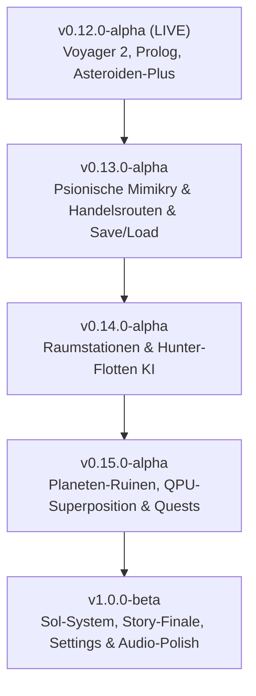

# 🌌 ROADMAP & GAME DESIGN DOCUMENT: DER WEG ZUR BETA
**Projekt:** *Where Stars Die: Pillars of The Void* (Project Najmafar)  
**Status:** Alpha v0.12.0 ➔ Ziel: Beta v1.0.0  
**Dokument-Version:** 1.0 (Stand: 16. September 2026)

---

## 1. Kern-Vision & Design-Säulen
*Where Stars Die* ist ein kosmisches Survival-Rollenspiel aus der Orbit-/Top-Down-Perspektive. Der Spieler steuert kein mechanisches Raumschiff, sondern **Najmafar** – ein uraltes, denkendes, biomechanisches und psionisches Wesen.
- **Säule 1: Das lebende Schiff (Biomasse, Silizium & Geist)** – Najmafar atmet, heilt sich, leidet unter Einsamkeit und absorbiert Crew-Wirte zur Steigerung seiner kognitiven Fähigkeiten.
- **Säule 2: Kosmische Melancholie & Hoffnung** – Das Universum stirbt („Säulen der Leere“). Das Auffinden archaischer menschlicher Relikte (Voyager 2) entfacht den Funken, nach der Wiege dieses Signals zu suchen.
- **Säule 3: Echte Quantenmechanik (IBM Quantum)** – Nutzung realer QPU-Schaltkreise für Musik, Superposition von Welten und evolutionäre Mutationen.

---

## 2. Detaillierte Feature-Konzepte

### 🧬 A. Psionische Mimikry & Gestaltwandlung (Shapeshifting)
Najmafar besitzt keine gewöhnliche Tarnkappe, sondern faltet seinen organischen Chitin-Körper um und projiziert ein psionisches Trugbild:
1. **Asteroiden-Modus (Stille Trümmer):**
   - *Aktivierung:* Taste `[T]` bei Stillstand oder minimaler Drift.
   - *Effekt:* Najmafar zieht Tentakel ein, stoppt Emissionen und tarnt sich als lebloser Felsbrocken.
   - *Nutzen:* Feindliche Patrouillen und Hunter-Flotten fliegen ahnungslos vorbei.
2. **Frachter- & Zivilschiff-Mimikry:**
   - *Funktion:* Najmafar moduliert sein Magnetfeld und reflektiert Radarsignaturen gewöhnlicher Erzfrachter.
   - *Gameplay:* Erlaubt das gefahrlose Passieren von Föderations-Kontrollpunkten und das Annähern an Raumstationen.
   - *Gefahr (Deep-Scan):* Wachschiffe der Stufe 3 führen Spektralscans durch. Bleibt Najmafar zu lange im Scan-Kegel, bricht die Illusion zusammen.
3. **Ressourcenverbrauch:**
   - Kostet kontinuierlich mentale Bio-Energie (Stress/Psyche sinkt bei längerem Einsatz).

---

### ⚔️ B. Zivilisationen, Alarmstufen & Hunter-Flotten (Nemesis-System)
Wer Planeten entvölkert und Biomasse absaugt, erregt die Aufmerksamkeit der Raumstreitkräfte:
1. **System-Bedrohungslevel (Heat / Alert Level 1 bis 5):**
   - Level 1: Friedliche Handelsrouten, gelegentliche Patrouillen.
   - Level 3: Verstärkte Militärpräsenz, Sensor-Bojen an Hyperraum-Schnittstellen.
   - Level 5: **„Apex-Hunter“ entsandt.** Schwere Biowaffen-Kreuzer suchen gezielt nach psionischen FTL-Spuren.
2. **Hyperraum-Fährten:**
   - Nach Warp-Sprüngen bleibt eine flüchtige Psionik-Verzerrung zurück, der Hunter-Schiffe folgen können.
3. **Flucht & Konter-Strategie:**
   - Ablenken der Jäger durch Asteroiden-Mimikry, EMP-Pulse oder Sprung durch gefährliche Sonnen-Koronas.

---

### 🛰️ C. Lebendige Galaxie: Handelsrouten, Stationen & Forschungsschiffe
1. **Handelsstraßen & Frachtkonvois:**
   - Autonome Frachter fliegen mit Sub-Licht und Mikro-Warp zwischen bewohnten Welten und Raumstationen.
   - *Interaktion:* Spieler kann Frachter plündern (Silizium, Energie) oder im Schatten ihres Konvois mitreisen.
2. **Forschungsschiffe:**
   - Erkunden Gasriesen, Sonnenanomalien und Asteroidenfelder.
   - Tragen hochkarätige Wissenschaftler, die als ideale Crew-Wirte für Najmafar dienen.
3. **Raumstationen & Außenposten:**
   - Stationen im Orbit mit Hangars und Verteidigungs-Geschützen.
   - *Infiltrations-Modus:* Bei erfolgreicher Tarnung kann Najmafar andocken, Funksprüche belauschen, Blaupausen assimilieren oder Ressourcen absaugen.

---

### 🏛️ D. Planeten-Ruinen & Archäologie der Vorläufer
1. **Oberflächen-Scans:**
   - Auf toten, radioaktiven oder eisigen Welten entdeckt der Scanner verfallene Megastrukturen („Precursor Vaults“).
2. **Bergung von Gen-Fragmenten:**
   - Uralte organische Codes schalten neue Schiffs-Mutationen frei (z. B. Säure-Tentakel, Bio-Gravitationslinsen).
3. **Lore-Entschlüsselung:**
   - Textübertragungen und Logbücher erzählen vom Schicksal der Galaxie und warum Sterne erlöschen.

---

### ⚛️ E. Erweiterte Nutzung der IBM Quantum QPU
1. **Quanten-Superposition & Kollaps (Erkundung von Ruinen):**
   - Ruinen und Weltraum-Anomalien existieren vor der Erkundung in einer Überlagerung (Superposition aus mehreren Möglichkeiten: intaktes Relikt, Naniten-Falle, Energiequelle).
   - Beim Scanvorgang wird ein QPU-Schaltkreis ausgeführt: Erst die Quantenmessung (`measurement`) bringt die Wellenfunktion zum Kollaps und entscheidet die Wirklichkeit.
2. **Quanten-Verschränkungs-Sensor (Entanglement Early Warning):**
   - Najmafar nutzt verschränkte Qubits als Langstrecken-Spürsinn: Warnungen vor herannahenden Hunter-Flotten über Sektorgrenzen hinweg.
3. **VQE / Quanten-Interferenz bei Schiffs-Evolution:**
   - Mutationen im Bio-Labor werden durch quantenmechanische Zustandswahrscheinlichkeiten bestimmt – für echte kosmische Unvorhersehbarkeit.

---

## 3. Kampagnen-Struktur & Das Durchspielen (Story)

### Akt 1: Erwachen & Das Echo (Bereits implementiert)
- Najmafar erwacht im sterilen Heimatsystem.
- Scan der Welten offenbart absolute Leere.
- Ortung und Bergung von **Voyager 2**: Die Goldene Schallplatte weckt Hoffnung und liefert Pulsar-Referenzkoordinaten.

### Akt 2: Die Reise zur Wiege (Geplant: v0.13 – v0.15)
- Der Weg durch fremde Systeme, vorbei an Hunter-Flotten und Handelskorridoren.
- Entschlüsselung von 4 alten Pulsar-Signalbojen in verschiedenen Galaxie-Clustern.
- Infiltration von Megastationen zur Beschaffung von Hyperraum-Katalysatoren.

### Akt 3: Das Sol-System & Das Finale (Geplant: v0.16 / Beta)
- Ankunft am Rand des Sonnensystems (Kuipergürtel, Saturn, Erde).
- Die Erde ist von einer Entropie-Dunkelheit („Säulen der Leere“) bedroht.
- **Drei mögliche Enden:**
  1. **Symbiose (Das goldene Ende):** Najmafar verschmilzt mit dem irdischen Netz, heilt die Atmosphäre und rettet Menschheit & eigene Spezies.
  2. **Absorption (Das dunkle Ende):** Najmafar saugt die Biosphäre der Erde auf, um als neugeborener Titanenstern durch die Leere zu wandern.
  3. **Wächter (Das bittersüße Ende):** Najmafar opfert seinen physischen Körper, um das Sonnensystem für alle Ewigkeit vor den Hunter-Flotten abzukapseln.

---

## 4. Release-Fahrplan zur Beta (Milestone Schedule)

| Version | Meilenstein | Haupt-Inhalte |
| :--- | :--- | :--- |
| **v0.13.0** | **Tarnung & Save/Load** | • Psionische Mimikry (`[T]` Asteroid/Frachter) • Persistentes Speichersystem (Save/Load via LocalStorage/JSON) • Autonome Frachtschiffe auf festen Routen |
| **v0.14.0** | **Stationen & Nemesis-Jäger** | • Raumstationen mit Andock-Interface • Fraktions-Alarmstufen & Hunter-Schiffe auf FTL-Fährten |
| **v0.15.0** | **Ruinen & QPU-Superposition** | • Planeten-Ruinen mit spektralen Puzzles • IBM Quantum Wellenfunktions-Kollaps beim Scannen • Missions- & Quest-Tagebuch im HUD |
| **v1.0.0-beta**| **Sol-System & Story-Finale** | • Pulsar-Navigationsnetz zur Erde • Finale Boss- / Entscheidungskonfrontation im Sol-System • Vollständige deutsche & englische Lokalisierung |

---

*Dieses Dokument dient als verbindlicher Leitfaden für künftige Feature-Branches und Architektur-Entscheidungen.*
